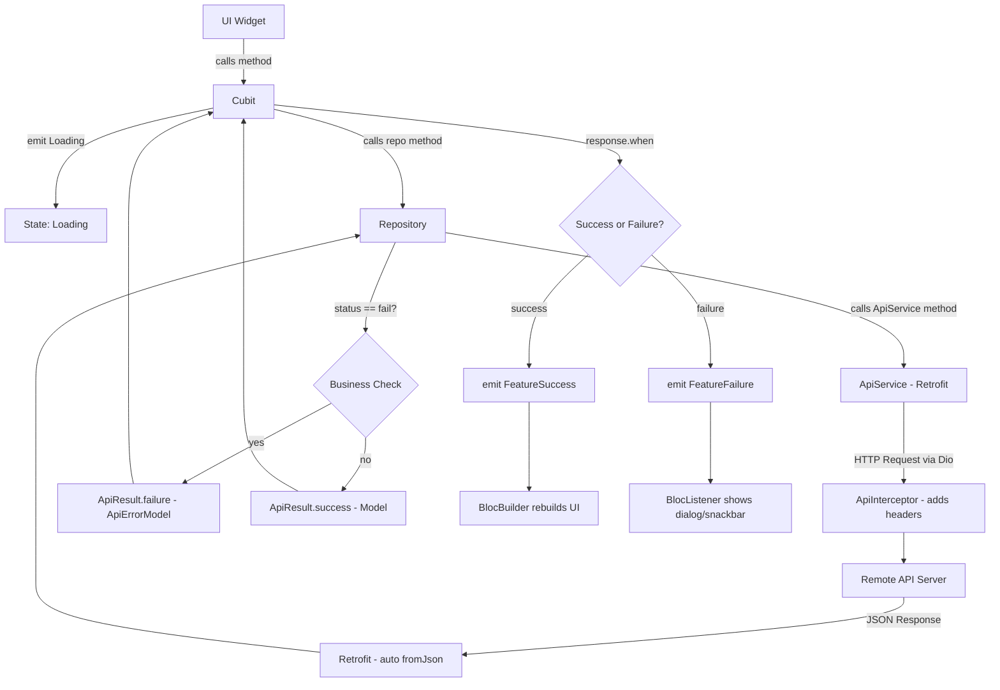

# PROJECT_RULES.md

> **مرجع دائم للذكاء الاصطناعي** — مستخرج من الكود الفعلي للمشروع.
> أي AI يقرأ هذا الملف يجب أن يكون قادرًا على تطوير ميزات جديدة بنفس أسلوب المشروع الأصلي.

---

## 1. Project Overview

| Item | Value |
|---|---|
| **Project Name** | `study` |
| **Architecture** | Feature-First Clean Architecture |
| **State Management** | Flutter Bloc (Cubit) |
| **DI** | GetIt (manual registration) |
| **Network** | Dio + Retrofit |
| **Localization** | easy_localization (en/ar) |
| **Routing** | MaterialApp `onGenerateRoute` + Named Routes |
| **Local Storage** | SharedPreferences via `CacheHelper` |
| **Entry Point** | `lib/main.dart` |

**App Flow:**
```
main() → setupService() → CacheHelper.init() → ConnectivityController.init()
       → EasyLocalization wrapper → MyApp → BlocProvider<AppCubit>
       → MaterialApp (onGenerateRoute) → SplashScreen → HomeScreen
```

---

## 2. Complete Folder Structure

```
lib/
├── main.dart                    # Entry point
├── app/
│   ├── app.dart                 # MyApp widget (MaterialApp config)
│   └── cubit/
│       ├── app_cubit.dart       # Global app settings (theme + locale)
│       └── app_state.dart       # AppSettingsChanged state
├── core/
│   ├── errors/                  # (reserved — not yet populated)
│   ├── extensions/
│   │   ├── color_extension.dart       # MyColors ThemeExtension
│   │   ├── navigation_extention.dart  # BuildContext nav helpers + text/color getters
│   │   └── responsive_extention.dart  # (commented out — reserved for future)
│   ├── get_it/
│   │   └── get_it.dart          # Service Locator registration (manual)
│   ├── helpers/
│   │   ├── app_regex.dart             # Email / password / phone regex validators
│   │   ├── build_error_or_success_bar.dart  # SnackBar + AwesomeDialog helpers
│   │   ├── cache_helper.dart          # SharedPreferences wrapper
│   │   ├── connectivity_controller.dart     # Network connectivity singleton
│   │   ├── observer.dart              # BlocObserver implementation
│   │   ├── responsive.dart            # Text scale computation
│   │   └── return_response_service.dart     # (minimal — TBD)
│   ├── localization/
│   │   ├── localization_manager.dart  # Supported locales + paths
│   │   └── l10n/                      # (empty — future ARB files)
│   ├── routes/
│   │   ├── route_string.dart    # Route name constants
│   │   ├── route.dart           # AppRoutes.onGenerateRoute switch
│   │   └── base_routes.dart     # BaseRoute (PageRouteBuilder) with transitions
│   ├── service/
│   │   └── api/
│   │       ├── api_constants.dart     # Base URL + endpoint constants + ApiErrors
│   │       ├── api_error_handler.dart # ErrorHandler.handle() — maps DioException
│   │       ├── api_error_model.dart   # ApiErrorModel (json_serializable)
│   │       ├── api_interceptors.dart  # ApiInterceptor (Dio Interceptor)
│   │       ├── api_result.dart        # ApiResult<T> sealed class (Success/Failure)
│   │       ├── api_service.dart       # Retrofit abstract class (ApiService)
│   │       ├── api_service.g.dart     # Generated Retrofit code
│   │       └── dio_factory.dart       # DioFactory singleton (Dio config)
│   ├── theme/
│   │   ├── colors.dart                # AppColors (all color constants + gradients)
│   │   ├── app_theme_light.dart       # lightTheme() function
│   │   ├── app_theme_dark.dart        # darkTheme() function
│   │   ├── app_text_theme_dark.dart   # Dark text theme
│   │   └── text_style.dart            # (commented out — reserved)
│   ├── utils/
│   │   ├── app_strings.dart           # AppStrings constants + localized keys
│   │   └── app_key_string.dart        # Keys class (SharedPrefs keys)
│   └── widgets/
│       ├── custom_button.dart         # Reusable button widget
│       ├── custom_text_field.dart     # Reusable text field widget
│       ├── failer_widget.dart         # Error/failure UI widget
│       └── loading.dart               # Loading indicator widget
└── features/
    ├── splash/
    │   └── splash_screen.dart
    ├── Login/                         # NOTE: Capital L (existing naming)
    │   ├── login_screen.dart
    │   ├── data/
    │   │   ├── login_repo.dart
    │   │   └── model/
    │   │       └── response_login_model.dart
    │   ├── logic/
    │   │   └── cubit/
    │   │       ├── login_cubit.dart
    │   │       └── login_state.dart   (part of login_cubit.dart)
    │   └── widget/
    │       ├── emailAndPassword.dart
    │       ├── login_bloc_listener.dart
    │       ├── logoauth.dart
    │       └── password_validations.dart
    └── home/
        ├── data/
        │   ├── models/
        │   │   └── response_home_model.dart
        │   └── repos/
        │       └── home_repo.dart
        └── presentation/
            ├── cubit/
            │   ├── home_cubit.dart
            │   └── home_state.dart    (part of home_cubit.dart)
            └── screens/
                └── home_screen.dart
```

---

## 3. Dependency Injection (GetIt)

**Library:** `get_it: ^9.2.0`  
**Registration file:** `lib/core/get_it/get_it.dart`  
**Called in:** `main()` → `setupServise()`

### Registration Types Used

| Type | Used For | Example |
|---|---|---|
| `registerSingleton` | Single persistent instance | `CacheHelper` |
| `registerLazySingleton` | Created on first use | `HomeRepo`, `ConnectivityController` |
| `registerFactory` | New instance every time | `AppCubit`, `HomeCubit` |

### Current Registrations

```dart
final getIt = GetIt.instance;

void setupServise() {
  // Infrastructure
  getIt.registerLazySingleton<ConnectivityController>(
    () => ConnectivityController.instance,
  );
  getIt.registerSingleton<CacheHelper>(CacheHelper());

  // App-level
  getIt.registerFactory<AppCubit>(() => AppCubit());

  // Home feature
  getIt.registerLazySingleton<HomeRepo>(() => HomeRepo(getIt()));
  getIt.registerFactory<HomeCubit>(() => HomeCubit(getIt()));
}
```

### How to Register a New Feature (MANDATORY pattern)

```dart
// 1. Register Repo as LazySingleton (receives ApiService via getIt())
getIt.registerLazySingleton<MyFeatureRepo>(() => MyFeatureRepo(getIt()));

// 2. Register Cubit as Factory (receives Repo via getIt())
getIt.registerFactory<MyFeatureCubit>(() => MyFeatureCubit(getIt()));
```

> ⚠️ The `ApiService` instance (`getIt<ApiService>()`) must also be registered before repos that depend on it. Currently commented out — enable when wiring up Dio:
> ```dart
> Dio dio = DioFactory.getDio();
> getIt.registerLazySingleton<ApiService>(() => ApiService(dio));
> ```

---

## 4. State Management (Cubit)

**Library:** `flutter_bloc: ^9.1.1` + `bloc: ^9.1.0`

Every feature uses **Cubit** (not full Bloc — no events). States are declared using the `part`/`part of` pattern in the same file as the Cubit.

### State Class Pattern

```dart
// feature_state.dart
part of 'feature_cubit.dart';

@immutable                          // Login uses @immutable + sealed
sealed class LoginState {}          // OR: abstract class FeatureState {}

final class LoginInitial extends LoginState {}
final class LoginLoading extends LoginState {}
final class LoginSuccess extends LoginState {
  final String successString;
  LoginSuccess({required this.successString});
}
final class LoginFailure extends LoginState {
  final String message;
  LoginFailure({required this.message});
}
```

> **Note:** `LoginState` uses `sealed` + `final class`. `HomeState` uses `abstract class` + plain `class`. Both patterns exist. Prefer `sealed` + `final class` for new features (matches newer Dart style).

### Cubit Class Pattern

```dart
// feature_cubit.dart
import 'package:flutter_bloc/flutter_bloc.dart';

part 'feature_state.dart';

class HomeCubit extends Cubit<HomeState> {
  final HomeRepo _homeRepo;

  HomeCubit(this._homeRepo) : super(HomeInitial());

  void getHomeData() async {
    emit(HomeLoading());                         // ALWAYS emit loading first
    final response = await _homeRepo.getHomeData();

    response.when(
      success: (data) {
        if (!isClosed) emit(HomeSuccess(items: data.data?.items));
      },
      failure: (error) {
        if (!isClosed) emit(HomeFailure(message: error.messege ?? 'Unknown error'));
      },
    );
  }
}
```

### Mandatory Cubit Rules
- Always `emit(FeatureLoading())` **before** any async call.
- Always check `if (!isClosed)` before emitting in async callbacks.
- Use `response.when(success:, failure:)` — never pattern-match manually.
- Cubits receive their Repo via constructor injection.
- TextControllers and FormKeys **may** live inside the Cubit (see `LoginCubit`).

---

## 5. BlocConsumer / BlocBuilder / BlocListener Rules

### When to Use What

| Widget | Use When |
|---|---|
| `BlocListener` | Side effects only: navigation, dialogs, snackbars. **No UI rebuild.** |
| `BlocBuilder` | UI changes only: show loading spinner, error widget, data widget. |
| `BlocConsumer` | Both UI rebuild AND side effect in the same widget. |

### Real Project Example: BlocListener (Login)

```dart
// Isolate listener logic in a dedicated widget (LoginBlocListener)
class LoginBlocListener extends StatelessWidget {
  @override
  Widget build(BuildContext context) {
    return BlocListener<LoginCubit, LoginState>(
      listenWhen: (previous, current) =>
          current is LoginFailure ||
          current is LoginLoading ||
          current is LoginSuccess,
      listener: (context, state) {
        if (state is LoginSuccess) {
          context.pop();
          context.pushNamedAndRemoveUntil(StringRoute.main);
        } else if (state is LoginFailure) {
          context.pop();
          buildErorr(context, state.message);   // AwesomeDialog
        } else {
          // LoginLoading → show dialog spinner
          showDialog(
            context: context,
            builder: (_) => const Center(child: CircularProgressIndicator()),
          );
        }
      },
      child: const SizedBox.shrink(),           // No UI — listener only
    );
  }
}
```

### Pattern Rules
- **Always** wrap `BlocListener` in its own `StatelessWidget` (e.g. `LoginBlocListener`).
- Use `listenWhen` to filter only relevant states.
- The `child` of a pure `BlocListener` is `const SizedBox.shrink()`.
- In the screen, add the listener widget at the **bottom** of the `Column`.

---

## 6. Repository Pattern

The project uses a **concrete Repository class** (no interface/abstract layer yet). Each feature has one Repo that:
1. Receives `ApiService` via constructor.
2. Calls the API via `ApiService`.
3. Checks for business-level failures (`status == "fail"`).
4. Wraps results in `ApiResult<T>`.
5. Catches all exceptions via `ErrorHandler.handle(e)`.

### Repository Template

```dart
class FeatureRepo {
  final ApiService _apiService;

  FeatureRepo(this._apiService);

  Future<ApiResult<ResponseModel>> getData(/* params */) async {
    try {
      final response = await _apiService.endpointMethod(/* params */);

      // Business-level failure check
      if (response.status == "fail") {
        return ApiResult.failure(
          ApiErrorModel(status: response.status, messege: response.message),
        );
      }

      return ApiResult.success(response);
    } catch (e) {
      return ApiResult.failure(ErrorHandler.handle(e));   // Network / parse errors
    }
  }
}
```

### Location Rule
```
features/
└── feature_name/
    └── data/
        ├── feature_name_repo.dart     ← Repository
        └── models/
            └── response_model.dart    ← Model
```

---

## 7. API Layer

### Stack
- **HTTP Client:** `dio: ^5.9.0`
- **Code Generation:** `retrofit: ^4.4.1` + `build_runner`
- **Model Serialization:** `json_annotation` + generated `.g.dart`

### DioFactory

```dart
class DioFactory {
  DioFactory._();                    // Private constructor — static only

  static Dio? dio;

  static Dio getDio() {
    Duration timeOut = const Duration(seconds: 10);

    if (dio == null) {
      dio = Dio();
      dio!
        ..options.connectTimeout = timeOut    // 10 seconds
        ..options.receiveTimeout = timeOut;   // 10 seconds
      addDioInterceptor();
    }
    return dio!;
  }

  static void addDioInterceptor() {
    dio?.interceptors.add(ApiInterceptor());   // Custom headers
    dio?.interceptors.add(LogInterceptor(      // Full request/response logging
      request: true, requestHeader: true, requestBody: true,
      responseHeader: true, responseBody: true, error: true,
    ));
  }
}
```

### ApiInterceptor (Headers)

```dart
class ApiInterceptor extends Interceptor {
  @override
  void onRequest(RequestOptions options, RequestInterceptorHandler handler) {
    options.headers['Content-Type'] = "application/json";
    // options.headers['Authorization'] = 'Bearer $token';   ← Add when auth is ready
    // options.headers['Accept-Language'] = "en";
    super.onRequest(options, handler);
  }
}
```

### ApiConstants (Base URL + Endpoints)

```dart
class ApiConstants {
  static const String baseUrl = "http://www.myapiproject.rf.gd/e-ecommerse";

  // Auth
  static const String signUp        = "$baseUrl/auth/sign_up.php";
  static const String linklogin     = "$baseUrl/auth/login.php";
  static const String verfycode     = "$baseUrl/auth/verfycode.php";
  static const String sendverfycode = "$baseUrl/auth/sendverfycode.php";

  // Home
  static const String home = "$baseUrl/home.php";
}
```

> ⚠️ **Always add new endpoints to `ApiConstants`** — never hardcode URLs anywhere else.

### ApiService (Retrofit)

```dart
@RestApi(baseUrl: ApiConstants.baseUrl)
abstract class ApiService {
  factory ApiService(Dio dio, {String baseUrl}) = _ApiService;

  @POST(ApiConstants.linklogin)
  Future<ResponseLogin> login(@Body() dynamic body);

  @GET(ApiConstants.home)
  Future<ResponseHomeModel> getHomeData();
}
```

> After adding a method, run: `flutter pub run build_runner build --delete-conflicting-outputs`

---

## 8. ApiResult — Response Wrapper

All API calls return `ApiResult<T>` — a custom sealed union (similar to `Either` or `freezed`).

```dart
abstract class ApiResult<T> {
  factory ApiResult.success(T data)            = Success<T>;
  factory ApiResult.failure(ApiErrorModel error) = Failure<T>;

  R when<R>({
    required R Function(T data) success,
    required R Function(ApiErrorModel error) failure,
  });
  // + whenOrNull, maybeWhen, map, mapOrNull, maybeMap
}
```

### Usage in Cubit

```dart
final response = await _repo.getData();

response.when(
  success: (data) { emit(FeatureSuccess(data: data)); },
  failure: (error) { emit(FeatureFailure(message: error.messege ?? '')); },
);
```

> **Never** use `if (response is Success)` pattern — always use `.when()`.

---

## 9. Error Handling Flow

```
DioException / Exception
        ↓
ErrorHandler.handle(e)        ← lib/core/service/api/api_error_handler.dart
        ↓
ApiErrorModel(messege, status)
        ↓
ApiResult.failure(error)      ← returned from Repo
        ↓
response.when(failure: ...)   ← handled in Cubit
        ↓
emit(FeatureFailure(message)) ← state emitted
        ↓
BlocListener → buildErorr()   ← AwesomeDialog shown to user
```

### ErrorHandler Maps

| DioExceptionType | Message |
|---|---|
| `connectionError` | "Connection to server failed. Please check your network." |
| `connectionTimeout` | "Connection timeout. Please try again later." |
| `receiveTimeout` | "Receive timeout. Server is not responding." |
| `sendTimeout` | "Send timeout. Please check your network speed." |
| `badResponse` | Parses `ApiErrorModel.fromJson(response.data)` |
| `cancel` | "Request to server was cancelled" |
| `badCertificate` | "SSL certificate verification failed" |
| `unknown` (SocketException) | "No internet connection" |

### User Feedback Functions (build_error_or_success_bar.dart)

```dart
buildErorr(context, message);            // AwesomeDialog — error type
buildSuccess(context, title, onPress);   // AwesomeDialog — success type
buildErrorBar(context, message);         // Red SnackBar (floating)
buildSuccessBar(context, message);       // Green SnackBar (floating)
```

---

## 10. Models

### Parsing Strategy: **Manual `fromJson` / `toJson`**

All models use manual parsing — **no `freezed`**, **no code generation for feature models**.

The `ApiErrorModel` is the only model using `@JsonSerializable`.

### Feature Model Template

```dart
class ResponseFeatureModel {
  final String? status;
  final String? message;
  final FeatureData? data;

  ResponseFeatureModel({this.status, this.message, this.data});

  factory ResponseFeatureModel.fromJson(Map<String, dynamic> json) {
    return ResponseFeatureModel(
      status: json['status'],
      message: json['message'],
      data: json['data'] != null ? FeatureData.fromJson(json['data']) : null,
    );
  }

  Map<String, dynamic> toJson() {
    return {'status': status, 'message': message, 'data': data?.toJson()};
  }
}

class FeatureData {
  final List<ItemModel>? items;

  FeatureData({this.items});

  factory FeatureData.fromJson(Map<String, dynamic> json) {
    return FeatureData(
      items: (json['items'] as List?)
          ?.map((e) => ItemModel.fromJson(e))
          .toList(),
    );
  }

  Map<String, dynamic> toJson() => {'items': items?.map((e) => e.toJson()).toList()};
}
```

### Naming Convention

| Class Type | Naming Pattern | Example |
|---|---|---|
| API Response Wrapper | `Response{Feature}Model` | `ResponseHomeModel` |
| Sub-model (data) | `{Feature}Data` | `HomeData` |
| Item/entity model | `{Name}Model` | `ProductModel` |

---

## 11. Routing

**Strategy:** `MaterialApp.onGenerateRoute` + `switch` statement

### Route Names (StringRoute)

```dart
abstract class StringRoute {
  static const String splash = 'splash';
  static const String main   = 'main';
  static const String home   = 'home';
}
```

> Add all new routes here as `static const String`.

### Route Registration (AppRoutes)

```dart
class AppRoutes {
  static Route<void> onGenerateRoute(RouteSettings settings) {
    switch (settings.name) {
      case StringRoute.splash:
        return BaseRoute(page: const SplashScreen(), transitionType: RouteTransitionType.fade);

      case StringRoute.home:
        return BaseRoute(page: const HomeScreen(), transitionType: RouteTransitionType.fade);

      default:
        return BaseRoute(page: const Scaffold(), transitionType: RouteTransitionType.fade);
    }
  }
}
```

### Available Transition Types

```dart
enum RouteTransitionType {
  fade, slideRight, slideLeft, slideUp, slideDown, scale, rotation, size
}
```

Default transition duration: **700ms** with `Curves.easeInOutCubic`.

### Navigation (BuildContext Extension)

```dart
context.pushName(StringRoute.home);                   // push
context.pushReplacementNamed(StringRoute.home);        // replace
context.pushNamedAndRemoveUntil(StringRoute.main);     // clear stack
context.pop();                                         // pop
```

---

## 12. Local Storage (CacheHelper)

**Library:** `shared_preferences: ^2.5.4`

```dart
// Keys are defined in: lib/core/utils/app_key_string.dart
class Keys {
  static const String themeMode = 'themeMode';
  static const String language  = 'language';
}

// Usage
await getIt<CacheHelper>().saveData(key: Keys.themeMode, value: 'dark');
final theme = getIt<CacheHelper>().getData(key: Keys.themeMode);
await getIt<CacheHelper>().removeData(key: Keys.themeMode);
```

> Always access via `getIt<CacheHelper>()`. Never instantiate CacheHelper directly.

---

## 13. Theme

### Structure

```
core/theme/
├── colors.dart              # AppColors — all static const colors + gradients
├── app_theme_light.dart     # lightTheme(width, scale, context) function
├── app_theme_dark.dart      # darkTheme(width, scale, context) function
└── app_text_theme_dark.dart # Dark typography
```

### Color Access

```dart
// Via extension (preferred inside widgets)
context.color.moreLightGray    // ThemeExtension<MyColors>

// Via AppColors directly (preferred in theme definitions)
AppColors.primary              // Color(0xFF667EEA)
AppColors.primaryGradient      // LinearGradient
```

### Text Style Access

```dart
context.textStyle.displayLarge    // Theme.of(context).textTheme.displayLarge
context.textStyle.bodyLarge
context.textStyle.bodyMedium
```

### AppColors Key Colors

| Token | Value | Use |
|---|---|---|
| `primary` | `#667EEA` | Primary actions, buttons |
| `secondary` | `#764BA2` | Secondary elements |
| `accent` | `#F093FB` | Highlights |
| `background` | `#F8F9FA` | Screen backgrounds (light) |
| `backgroundDark` | `#1A1A2E` | Screen backgrounds (dark) |
| `success` | `#00B894` | Success states |
| `error` | `#E74C3C` | Error states |
| `warning` | `#FDAA5D` | Warning states |

> ❌ **Never hardcode colors** — always use `AppColors.xxx` or `context.color.xxx`.

---

## 14. Localization

**Library:** `easy_localization: ^3.0.8`

```
assets/lang/
├── en.json    # English translations
└── ar.json    # Arabic translations
```

### Translation Keys

```json
// en.json
{
  "splash_title": "Hello from Flutter Forge",
  "splash_tagline": "Launch faster with clean architecture"
}
```

### Usage in Code

```dart
// In AppStrings (non-const — needs context)
static String splashTitle = 'splash_title'.tr();

// Direct usage
Text('splash_title'.tr())
```

### Changing Language

```dart
context.read<AppCubit>().toArabic(context);     // → saves + emits + rebuilds
context.read<AppCubit>().toEnglish(context);
```

Supported locales: `en`, `ar`. Fallback: `en`.

---

## 15. Responsive UI

**Library:** `advanced_responsive: ^1.0.3`

The `Responsive` helper computes a `textScale` factor based on screen width:

```dart
// In app.dart — computed once per rebuild
final width = MediaQuery.sizeOf(context).width;
final scale = Responsive.computeTextScale(width);   // Step-based, cached

// Then passed into lightTheme / darkTheme
theme: lightTheme(width, scale, context),
```

**Scale logic:** base width = 360px, step = 80px, each step adds 5% scale, clamped to `[0.85, 1.45]`.

---

## 16. Custom Widgets (core/widgets)

| Widget | File | Purpose |
|---|---|---|
| `CustomButton` | `custom_button.dart` | Reusable elevated/styled button |
| `CustomTextField` | `custom_text_field.dart` | Reusable form input with validation |
| `FailerWidget` | `failer_widget.dart` | Failure/error state UI |
| `Loading` | `loading.dart` | Loading indicator |

> ✅ Always prefer these widgets over creating inline UI. Add to this folder if a widget is used across 2+ features.

---

## 17. Extensions (core/extensions)

| Extension | File | Provides |
|---|---|---|
| `Navigation on BuildContext` | `navigation_extention.dart` | `pushName`, `pushReplacementNamed`, `pushNamedAndRemoveUntil`, `pop`, `context.color`, `context.textStyle` |
| `MyColors` (ThemeExtension) | `color_extension.dart` | `context.color.moreLightGray` — theme-aware colors |
| `StringExtension on String?` | `navigation_extention.dart` | `.isNullOrEmpty()` |
| `ListExtension<T> on List<T>?` | `navigation_extention.dart` | `.isNullOrEmpty()` |
| `MapExtension<K,V> on Map?` | `navigation_extention.dart` | `.isNullOrEmpty()` |

---

## 18. Helpers

| Helper | File | Purpose |
|---|---|---|
| `AppRegex` | `app_regex.dart` | Email, password, phone validation regex |
| `CacheHelper` | `cache_helper.dart` | SharedPreferences wrapper |
| `ConnectivityController` | `connectivity_controller.dart` | Singleton network state |
| `MyBlocObserver` | `observer.dart` | Logs Bloc lifecycle (onCreate, onChange, onClose) |
| `Responsive` | `responsive.dart` | Text scale computation |
| `buildErorr / buildSuccess` | `build_error_or_success_bar.dart` | AwesomeDialog shortcuts |
| `buildErrorBar / buildSuccessBar` | `build_error_or_success_bar.dart` | SnackBar shortcuts |

---

## 19. Network Response Flow



---

## 20. Authentication

**Current State:** Login is implemented. No token persistence, no refresh token, no secure storage.

### Login Flow

```
LoginScreen
  └── BlocProvider<LoginCubit>
      └── EmailAndPassword (Form widget — reads controllers from Cubit)
      └── LoginBlocListener (side effects)
      └── AppTextButton → cubit.emitLoginStates(context)

LoginCubit.emitLoginStates(context):
  1. Validate form (GlobalKey<FormState>)
  2. emit(LoginLoading())
  3. _loginRepo.login(email, password)
  4. response.when(
       success → emit(LoginSuccess())
       failure → emit(LoginFailure(message))
     )

LoginBlocListener:
  LoginLoading  → showDialog(CircularProgressIndicator)
  LoginSuccess  → pop dialog → pushNamedAndRemoveUntil(StringRoute.main)
  LoginFailure  → pop dialog → buildErorr(context, message)
```

> Token refresh: **Not implemented.**
> Secure Storage: **Not used** — credentials are read from `CacheHelper` (SharedPrefs).

---

## 21. Feature Development Guide (Step-by-Step)

When adding a new feature `product`, follow these exact steps:

### Step 1: Create Folder Structure

```
lib/features/product/
├── data/
│   ├── models/
│   │   └── response_product_model.dart
│   └── repos/
│       └── product_repo.dart
└── presentation/
    ├── cubit/
    │   ├── product_cubit.dart
    │   └── product_state.dart      ← (part of product_cubit.dart)
    ├── screens/
    │   └── product_screen.dart
    └── widgets/
        └── product_bloc_listener.dart
```

### Step 2: Create Model

```dart
// lib/features/product/data/models/response_product_model.dart
class ResponseProductModel {
  final String? status;
  final String? message;
  final ProductData? data;

  ResponseProductModel({this.status, this.message, this.data});

  factory ResponseProductModel.fromJson(Map<String, dynamic> json) =>
      ResponseProductModel(
        status: json['status'],
        message: json['message'],
        data: json['data'] != null ? ProductData.fromJson(json['data']) : null,
      );

  Map<String, dynamic> toJson() =>
      {'status': status, 'message': message, 'data': data?.toJson()};
}
```

### Step 3: Add Endpoint to ApiConstants

```dart
// lib/core/service/api/api_constants.dart
static const String products = "$baseUrl/products.php";
```

### Step 4: Add Method to ApiService

```dart
// lib/core/service/api/api_service.dart
@GET(ApiConstants.products)
Future<ResponseProductModel> getProducts();
```

Then run: `flutter pub run build_runner build --delete-conflicting-outputs`

### Step 5: Create Repository

```dart
// lib/features/product/data/repos/product_repo.dart
class ProductRepo {
  final ApiService _apiService;
  ProductRepo(this._apiService);

  Future<ApiResult<ResponseProductModel>> getProducts() async {
    try {
      final response = await _apiService.getProducts();
      if (response.status == "fail") {
        return ApiResult.failure(
          ApiErrorModel(status: response.status, messege: response.message),
        );
      }
      return ApiResult.success(response);
    } catch (e) {
      return ApiResult.failure(ErrorHandler.handle(e));
    }
  }
}
```

### Step 6: Create States

```dart
// part of 'product_cubit.dart'
sealed class ProductState {}
final class ProductInitial extends ProductState {}
final class ProductLoading extends ProductState {}
final class ProductSuccess extends ProductState {
  final ResponseProductModel data;
  ProductSuccess({required this.data});
}
final class ProductFailure extends ProductState {
  final String message;
  ProductFailure({required this.message});
}
```

### Step 7: Create Cubit

```dart
class ProductCubit extends Cubit<ProductState> {
  final ProductRepo _repo;
  ProductCubit(this._repo) : super(ProductInitial());

  void getProducts() async {
    emit(ProductLoading());
    final response = await _repo.getProducts();
    response.when(
      success: (data) { if (!isClosed) emit(ProductSuccess(data: data)); },
      failure: (error) { if (!isClosed) emit(ProductFailure(message: error.messege ?? '')); },
    );
  }
}
```

### Step 8: Register in GetIt

```dart
// lib/core/get_it/get_it.dart — inside setupServise()
getIt.registerLazySingleton<ProductRepo>(() => ProductRepo(getIt()));
getIt.registerFactory<ProductCubit>(() => ProductCubit(getIt()));
```

### Step 9: Add Route

```dart
// lib/core/routes/route_string.dart
static const String product = 'product';

// lib/core/routes/route.dart — inside switch
case StringRoute.product:
  return BaseRoute(page: const ProductScreen(), transitionType: RouteTransitionType.fade);
```

### Step 10: Build Screen

```dart
class ProductScreen extends StatelessWidget {
  const ProductScreen({super.key});

  @override
  Widget build(BuildContext context) {
    return BlocProvider(
      create: (_) => getIt<ProductCubit>()..getProducts(),
      child: Scaffold(
        body: SafeArea(
          child: Column(
            children: [
              BlocBuilder<ProductCubit, ProductState>(
                builder: (context, state) {
                  if (state is ProductLoading) return const Loading();
                  if (state is ProductFailure) return FailerWidget(message: state.message);
                  if (state is ProductSuccess) return _ProductList(data: state.data);
                  return const SizedBox.shrink();
                },
              ),
              const ProductBlocListener(),   // Side effects widget
            ],
          ),
        ),
      ),
    );
  }
}
```

---

## 22. New API Checklist

```
□ Add endpoint constant to ApiConstants
□ Add method to ApiService (abstract class)
□ Run build_runner to regenerate api_service.g.dart
□ Create Response Model (manual fromJson/toJson)
□ Create sub-models if needed
□ Create Repository class (receives ApiService)
    □ try/catch with ErrorHandler.handle(e)
    □ Business-level status == "fail" check
    □ Return ApiResult.success / ApiResult.failure
□ Create State file (sealed class + Loading/Success/Failure)
□ Create Cubit (emit Loading → call repo → response.when → emit result)
    □ Check isClosed before emitting in async callbacks
□ Register Repo as LazySingleton in get_it.dart
□ Register Cubit as Factory in get_it.dart
□ Add route constant to StringRoute
□ Add case to AppRoutes.onGenerateRoute
□ Build Screen with BlocProvider<Cubit>
□ Use BlocBuilder for UI states
□ Create BlocListener widget for navigation/dialogs
□ Handle Loading state → show Loading widget
□ Handle Success state → show data
□ Handle Failure state → show FailerWidget or buildErorr()
```

---

## 23. Coding Style & Naming Conventions

### Files
| Type | Convention | Example |
|---|---|---|
| Feature screens | `snake_case` | `home_screen.dart` |
| Repositories | `{feature}_repo.dart` | `home_repo.dart` |
| Cubits | `{feature}_cubit.dart` | `home_cubit.dart` |
| States | `{feature}_state.dart` | `home_state.dart` |
| Models | `response_{feature}_model.dart` | `response_home_model.dart` |
| Widgets | `{description}.dart` | `login_bloc_listener.dart` |

### Classes
| Type | Convention | Example |
|---|---|---|
| Cubit | `{Feature}Cubit` | `HomeCubit` |
| State base | `{Feature}State` | `HomeState` |
| State variants | `{Feature}{Status}` | `HomeLoading`, `HomeSuccess` |
| Repository | `{Feature}Repo` | `HomeRepo` |
| Model | `Response{Feature}Model` | `ResponseHomeModel` |
| Screen | `{Feature}Screen` | `HomeScreen` |

### Variables & Methods
- Private fields: `_camelCase` (e.g., `_homeRepo`, `_apiService`)
- Public methods: `camelCase` (e.g., `getHomeData`, `emitLoginStates`)
- Constants: `camelCase` in `static const` (e.g., `StringRoute.home`)
- Widget file names: prefer `snake_case`

---

## 24. Anti-Patterns Found

| Issue | Location | Recommendation |
|---|---|---|
| Missing `const` in `LoginInitial()` | `login_cubit.dart` | Use `const LoginInitial()` |
| Stale imports from old package name (`ecommerce_user`) | `login_screen.dart`, `emailAndPassword.dart` | Update all imports to `package:study/...` |
| `print()` in production code | `splash_screen.dart` | Use `dart:developer`'s `log()` or remove |
| `text_style.dart` is fully commented | `core/theme/text_style.dart` | Either implement or delete file |
| `responsive_extention.dart` fully commented | `core/extensions/` | Either implement or delete file |
| No interface for Repos | All features | Consider adding abstract interfaces for testability |
| `LoginCubit` holds `TextEditingController` | `login_cubit.dart` | Acceptable but prefer StatefulWidget ownership |
| `HomeState` uses `abstract class` | vs `LoginState` uses `sealed` | Standardize on `sealed` for all new features |

---

## 25. AI Development Rules (MUST FOLLOW)

```
✅ ALWAYS emit Loading before any async API call.
✅ ALWAYS check isClosed before emitting in async callbacks.
✅ ALWAYS use response.when() — never manual type checks.
✅ ALWAYS catch exceptions in Repository using ErrorHandler.handle(e).
✅ ALWAYS check business failure: if (response.status == "fail").
✅ ALWAYS register Repo (LazySingleton) and Cubit (Factory) in get_it.dart.
✅ ALWAYS use StringRoute constants — never hardcode route strings.
✅ ALWAYS wrap side-effect BlocListener in a dedicated StatelessWidget.
✅ ALWAYS use AppColors.xxx — never hardcode Color values.
✅ ALWAYS use context.textStyle.xxx — never hardcode TextStyle inline.
✅ ALWAYS use context.pushName() / context.pop() — never call Navigator directly.
✅ ALWAYS add new API endpoints to ApiConstants class.
✅ ALWAYS add new methods to ApiService abstract class and run build_runner.
✅ ALWAYS use CacheHelper via getIt<CacheHelper>() — never instantiate directly.
✅ ALWAYS use manual fromJson/toJson for feature models.
✅ ALWAYS use sealed class + final class for new State hierarchies.
✅ ALWAYS follow the folder structure: data/models/, data/repos/, presentation/cubit/, presentation/screens/, presentation/widgets/.

❌ NEVER call Dio, ApiService, or any network code directly from UI or Cubit.
❌ NEVER hardcode API URLs — use ApiConstants only.
❌ NEVER hardcode colors, strings, or text styles in widget files.
❌ NEVER skip the Loading state — always show feedback to the user.
❌ NEVER skip error handling — every API call must handle failure.
❌ NEVER navigate inside a Cubit — navigation belongs in BlocListener.
❌ NEVER use plain Navigator — always use BuildContext extensions.
❌ NEVER put business logic in a Widget — it belongs in a Cubit.
❌ NEVER create a new route without adding it to StringRoute and AppRoutes.
❌ NEVER create large monolithic widget files — split into separate widget files.
```

---

*Generated: 2026-06-29 | Source: Full static analysis of `lib/` source code*
